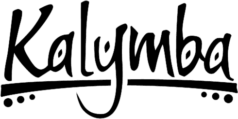

# Kalymba

This game system supports and enhances the play experience of _Kalymba_ in [Foundry VTT](https://foundryvtt.com/).


[](https://lgtm.com/projects/g/itsmegrave/kalymba/alerts/)

<div align=center>



</div>

<div align=justify>

**Kalymba** is an epic action-adventure **tabletop RPG** inspired by the **cultures and mythologies of the African continent**. Although it does not claim to faithfully portray historical ad social realities of its inspiration source, this fantastic scenario brings to the game table the essence of the African worldview, proposing to explore themes that are still not well developed in the contemporary RPG scene, while promoting a new African-inspired approach at traditional fantasy games as a whole. Furthermore, this book offers a **dynamic and intuitive rules system**, great for beginners, but robust enough for experienced players, and for running long-lasting campaigns.

</div>

<div align=justify>

## Installation

1. Go to the setup page and choose **Game Systems**.
2. Click the **Install System** button, and paste in this [manifest link](https://github.com/itsmegrave/kalymba/releases/latest/download/system.json)
3. Create a Game World using the Forbidden Lands system.

</div>

<div align=justify>

## Development

### Prerequisites

In order to build this system, recent versions of `node` and `yarn` are
required. Most likely, using `npm` also works, but only `yarn` is officially
supported. We recommend using the latest lts version of `node`. If you use `nvm`
to manage your `node` versions, you can simply run

```shell
nvm install
```

in the project's root directory.

You also need to install the project's dependencies. To do so, run

```shell
yarn install
```

### Building

You can build the project by running

```shell
yarn build
```

Alternatively, you can run

```shell
yarn build:watch
```

to watch for changes and automatically build as necessary.

### Linking the built project to Foundry VTT

In order to provide a fluent development experience, it is recommended to link
the built system to your local Foundry VTT installation's data folder. In
order to do so, first add a file called `foundryconfig.json` to the project root
with the following content:

```json
{
  "dataPath": "/absolute/path/to/your/FoundryVTT"
}
```

(if you are using Windows, make sure to use `\` as a path separator instead of
`/`)

Then run

```shell
yarn link-project
```

On Windows, creating symlinks requires administrator privileges, so unfortunately
you need to run the above command in an administrator terminal for it to work.

### Creating a release

The workflow works basically the same as the workflow of the [League Basic JS Module Template], please follow the
instructions given there.
</div>

<div align=justify>

## Licensing

This project is being developed under the terms of the
[LIMITED LICENSE AGREEMENT FOR MODULE DEVELOPMENT] for Foundry Virtual Tabletop.

- **Logo and Content:** The [Kalymba](https://dungeonist.com/kalymba-rpg-1a-edicao-digital/) logo and content is Copyright © and Trademarked by [Craftando Jogos](http://craftandojogos.com/). The parts of this project protected under this copyright may not be distributed commercially or freely. This includes art, logo, and copyright text sourced from the [Kalymba](https://dungeonist.com/kalymba-rpg-1a-edicao-digital/) tabletop RPG.

- **Source Code:** All source code _(typescript, hbs, scss, as well as system templates and the like)_, are Copyright © 2021 [itsmegrave](https://github.com/itsmegrave), and licenced under the [GNU General Public License v3.0](https://github.com/itsmegrave/kalymba/blob/main/LICENSE).

</div>

[League Basic JS Module Template]: https://github.com/League-of-Foundry-Developers/FoundryVTT-Module-Template
[LIMITED LICENSE AGREEMENT FOR MODULE DEVELOPMENT]: https://foundryvtt.com/article/license/
